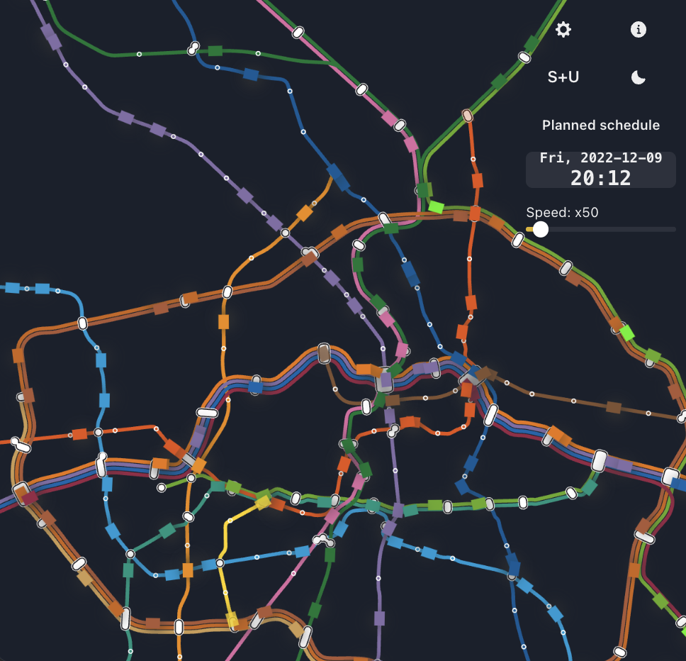

# Ubähnchen

**[ubähnchen.vercel.app](https://xn--ubhnchen-1za.vercel.app/)**

An animated live map of the Berlin U-Bahn.

 

## How it works

### Planned mode

Schedules are extracted from
the [GTFS data of the VBB](https://www.vbb.de/vbb-services/api-open-data/datensaetze/)
which contains
the `arrival time` and `departure time` for a time period of several months. The
movement of the train is simulated at constant speed between stations.

The GTFS data is currently manually updated, so it is constantly lagging a few
days behind latess updates from VBB.

### Live mode (beta)

Mandatory stuff: "Powered by VBB GmbH. All information without guarantee."

The [HAFAS API](https://github.com/public-transport/hafas-client) has a “radar”
endpoint, giving the position of all trains and some animation data, containing
stops information (origin, target, time) and a `proc`
value, which I think means "position between 2 stops in percent". So I'm using
that to place trains on the map.

Unfortunately, there are some implementation mistakes from me, causing trains to
move
weirdly or disappear.

### Maps

The [U-Bahn](https://de.wikipedia.org/wiki/Datei:U-Bahn_Berlin_-_Netzplan.svg)
map
and [S-Bahn+U-Bahn](https://de.wikipedia.org/wiki/Datei:S-_und_U-Bahn-Linien_Berlin.svg)
maps ( [CC BY-SA 4.0](https://creativecommons.org/licenses/by-sa/4.0/)) are
taken from Wikipedia and modified. In particular, the paths for the lines needed
to be made continuous, instead of being many disjoint portions.

### Animation

The display and animations is made with [paperjs](http://paperjs.org/).

### Thanks

* [Jannis R](https://github.com/derhuerst) for his libraries and documentation that were very helpful to build this project.
* VBB for publishing the data and having APIs that are necessary for this project. And also for running the trains.

## Development

### Setup

⚠️ Many steps are certainly missing. Please don't hesitate to open issues or PRs
before you get frustrated with this.

* `yarn install`
* `yarn build` in the gtfs-loader package. This should:
    * Download
      the [files from VBB](https://www.vbb.de/vbb-services/api-open-data/datensaetze/)
      in the `ubahnchen/GTFS` folder.
    * Filter out transportation modes that are not in use yet (bus, tram,
      boat...).
    * Save all relevant values in a SQLite database
* Run the unit test. They validate the data.
* `yarn dev` in the ui package.

### Things I like to look at in the future

* https://www.berlintransitmap.de/
* https://en.wikipedia.org/wiki/Berlin_U-Bahn

The timezones are probably not handled properly. Please make sure you are
in `CET` before running `yarn build` 😄
